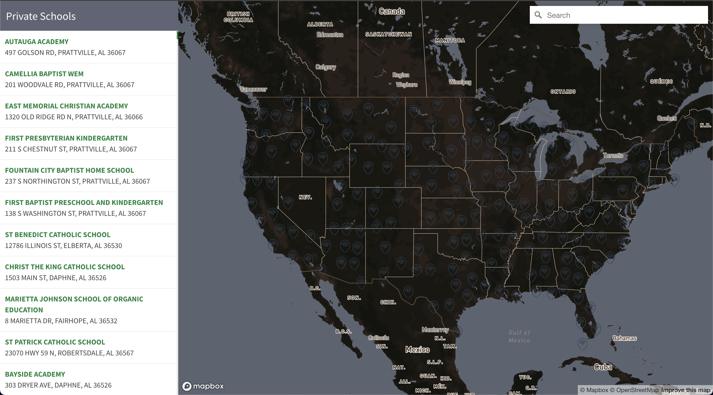

<div align="center">
  <a href="https://github.com/othneildrew/Best-README-Template">
  <!-- -color:#606474 -->
    <div style='background: linear-gradient(to bottom, #606474, #25e8a7, #21e0af, #1cdbb6, #19d6bc, #17cac9, #16c9ca,  #18c6ce, #0dc0d5, #10badc, #0daeea, #606474); width:80px; height:80px'>
        
    </div>
  </a>

  <h2 align="center">2017-18 Private Schools Near Me</h2>

  <p align="center">
    An awesome search engine finds all private schools for you!
  </p>
</div>

<details>
  <summary>Table of Contents</summary>
  <ol>
    <li>
      <a href="#about-the-project">About The Project</a>
      <ul>
        <li><a href="#project-goal">Project Goal</a></li>
        <li><a href="#main-function">Main function</a></li>
        <li><a href="#data-source">Data Source</a></li>
        <li><a href="#built-with">Built With</a></li>
      </ul>
    </li>
    <li><a href="#installation">Installation</a></li>
    <li><a href="#contributing">Contributing</a></li>
    <li><a href="#license">License</a></li>
    <li><a href="#contact">Contact</a></li>
    <li><a href="#acknowledgments">Acknowledgments</a></li>
  </ol>
</details>

<!-- ABOUT THE PROJECT -->

## About The Project

[Demo](link)

Map of Private Schools (independent schools) throughout the United States in 2017-18.

<p align="right">(<a href="#top">back to top</a>)</p>

### Project Goal

This project is intended create a private school search engine to provide all private schools information upon client's query address.

<p align="right">(<a href="#top">back to top</a>)</p>

### Main function

Enter a location or click on the map clusters to drill down and locate a school near you.

<p align="right">(<a href="#top">back to top</a>)</p>

### Data Source

[Private School Locations 2017-18](https://catalog.data.gov/dataset/private-school-locations-2017-18)

<p align="right">(<a href="#top">back to top</a>)</p>

### Built With

Here are some major libraries and web services used in the project.

- [Mapbox GL JS](https://docs.mapbox.com/mapbox-gl-js/api/)
- [Mapbox Studio](https://studio.mapbox.com/)
- [Github](https://github.com/)

<p align="right">(<a href="#top">back to top</a>)</p>

<!-- GETTING STARTED -->

## Installation

To get a local copy up and running follow these simple example steps.

1. Get a free API Key at [Mapbox](https://www.mapbox.com/)
2. Clone the repo
   ```sh
   git clone https://github.com/your_username_/Project-Name.git
   ```
3. Enter your API in `script.js`
   ```js
   mapboxgl.accessToken = "ENTER YOUR API";
   ```

<p align="right">(<a href="#top">back to top</a>)</p>

<!-- CONTRIBUTING -->

## Contributing

Contributions are what make the open source community such an amazing place to learn, inspire, and create. Any contributions you make are **greatly appreciated**.

If you have a suggestion that would make this better, please fork the repo and create a pull request. You can also simply open an issue with the tag "enhancement".
Don't forget to give the project a star! Thanks again!

1. Fork the Project
2. Create your Feature Branch (`git checkout -b feature/AmazingFeature`)
3. Commit your Changes (`git commit -m 'Add some AmazingFeature'`)
4. Push to the Branch (`git push origin feature/AmazingFeature`)
5. Open a Pull Request

<p align="right">(<a href="#top">back to top</a>)</p>

<!-- LICENSE -->

## License

Distributed under the MIT License. See `LICENSE.txt` for more information.

<p align="right">(<a href="#top">back to top</a>)</p>

<!-- CONTACT -->

## Contact

Rita Zhu - xiaoyz28@uw.edu

<p align="right">(<a href="#top">back to top</a>)</p>

<!-- ACKNOWLEDGMENTS -->

## Acknowledgments

Here's a list resources I find helpful and would like to give credit to.

- [Mapbox](https://www.mapbox.com/)
- [DATA.GOV](https://www.data.gov/)
- [GEOG 495](https://github.com/jakobzhao/geog495/blob/main/modules/module08/index3.html)

<p align="right">(<a href="#top">back to top</a>)</p>
